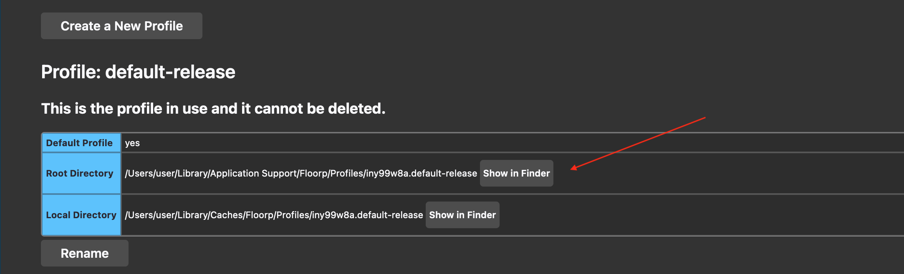

# Arc Inspired Floorp + Sidebery setup

If you like it (I can see it by amount of stars on the project ⭐️) I can make it easier to customize.

## How to install

1. Download and unzip the project:

<h3>Floorp</h3>

2. Download and install Floorp.
3. Go to `about:profiles`. Search for **Profile: default-release** and press **Show in Finder**.

4. Go to a folder ending with `.default-release` and find a `chrome` folder (create it if needed).
5. Drop `userChrome.css` inside the `chrome` folder (replace or create if needed).
6. Restart Floorp.
7. Go to Floorp settings:
    1. **Browser Manager sidebar** → **Show the Browser Manager Sidebar** - off.
    2. **Design** → **Tab Bar** → **Optimise browser for Vertical Tab Bar**.
    3. *(optional)* **Design** → **Tab Bar** → **Browser appearance** → **Firefox Proton UI**.
    4. *(optional)* **Home** → **Show blank page and disable background**.
7. View → Toolbar → Customise toolbar:
    1. **Bookmarks menu** :  
    `bookmarks toolbar items` (drag it from bookmarks bar) - `flexible space x3` - `search` - `flexible space x3` - `whatever you like here`.
    
    2. On the bottom select **Toolbars** → **Bookmarks Toolbar** → **Never Show**.

    Note: *Add bookmarks to bookmarks toolbar without name so only icon is displayed*.

# Sidebery

8. Install Sidebery add-on.
9. Go to **Settings** → **Help** → **Import addon data** → select `sidebery-settings.json`.

Note: *I removed the close tab button and close it with double click (you can adjust this and many other things from settings).*

### If you find any bugs just post it under the `issues` in this project. I'll fix it when I have time.
### If you want to support me and make me spend more time on this project: https://www.buymeacoffee.com/alex_coder